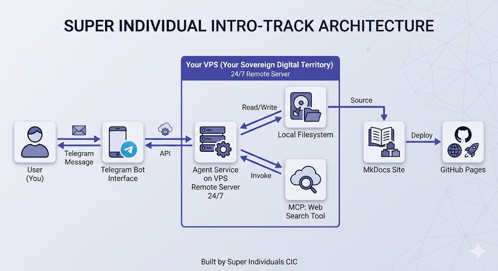

# 🧬 The Intro-Track Blueprint

The Intro Track is the shortest path from "I use AI chats" to "I run my own useful AI system."

Instead of starting with containers, dashboards, and automation sprawl, we focus on one practical outcome: **you message your own agent on your phone, it runs on your own server, saves work into your own files, and can publish useful results to your own website.**

This is designed for people who are curious about AI agents but do not want to disappear into technical complexity on day one.

### What You Build

By the end of this workshop, you will understand how to build a simple but real agent workflow:

* You send a request through Telegram.
* Your agent runs on your VPS 24/7.
* It can read and write files on your server.
* It can use tools like web search when needed.
* Its outputs can become a structured knowledge base published with MkDocs and GitHub Pages.

The point is not to impress people with infrastructure. The point is to create a system that is useful, portable, and fully yours.

### The Intro-Track Architecture

This image shows the complete flow of the Intro Track:

Read it from left to right:

* **You** send a message from Telegram.
* The **Telegram bot** passes that message to your agent.
* Your **agent service on the VPS** runs continuously, even when your laptop is closed.
* That agent can **read and write local files** and **call tools** such as web search.
* Those saved files become the source for your **MkDocs site**.
* GitHub Pages publishes the result as a live website.

This is the core promise of the Intro Track: **turn conversations into durable assets.**

### Why This Matters

Most people experience AI as a chat window. You ask, it answers, and then the result disappears into history.

This workshop introduces a different model:

* your AI can stay available 24/7
* your work can live in files you control
* your outputs can accumulate into a real library
* your setup can grow step by step instead of locking you into someone else's product

For a beginner, that is enough. It is already a major shift from "using AI" to **building with AI**.

### Who This Track Is For

This track is a good fit if:

* you are new to agents, servers, or automation
* you want a concrete first system instead of endless AI theory
* you want to understand the moving parts without drowning in tooling
* you want a workshop that feels practical, not abstract

### Want Something More Advanced?

If this Intro Track feels too simple, that is intentional. It is the foundation, not the ceiling.

We also support a more advanced **Builder Track** for people who want to go further into:

* multi-agent orchestration
* MCP tools and custom toolchains
* automation tools such as n8n and OpenCode
* deployment hygiene and operational discipline
* more sophisticated real-world use cases

If that is what you are looking for, use this Intro Track to understand the foundation first, then continue into the Builder Track on the Super Individuals website.

---

## 🛡️ Maintainers & Contributors

This knowledge base is a living document, curated and maintained by the **Super Individuals CIC** ecosystem. 

* **Yiju Jia & Dr. Bijun Li** — Co-Founding Directors & Chief Architects
* **Founding Cohort Member** — Founding Cohort Member & Debugging Contributors

> **Join the Build:** Found a typo? Discovered a better MCP tool? We encourage active builders to contribute. Ping us in the Discord `#resource-library` channel to suggest updates.
