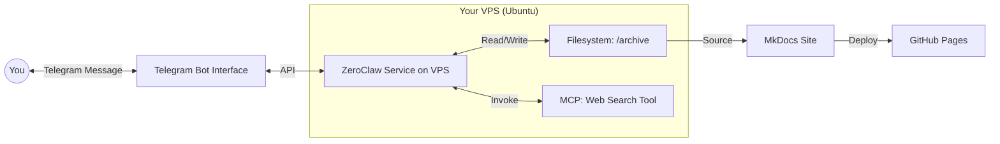

# 🧬 The Intro-Track Blueprint

In the Intro Track, we skip the complexity of containers and heavy orchestrators. We focus on the **Direct Power Path**: Your brain, translated into an Agent, living on your server, talking via Telegram.

### The Intro-Track Architecture

This is the exact flow of the system you are building:

The Three Pillars
The Sovereign Server: A Linode VPS where you have 100% control.

The ZeroClaw Agent: A lean engine that turns Markdown files (SOUL/SKILL) into intelligent action.

The Public Vault: Using MkDocs and GitHub Pages to turn your logs into a legacy.

---

## 🛡️ Maintainers & Contributors

This knowledge base is a living document, curated and maintained by the **Super Individuals CIC** ecosystem. 

* **Yiju Jia & Bijun Li** — Co-Founding Directors & Chief Architects
* **The Pioneer Cohort** — Batch-1 Alumni & Debugging Contributors

> **Join the Build:** Found a typo? Discovered a better MCP tool? We encourage active builders to contribute. Ping us in the Discord `#resource-library` channel to suggest updates.
